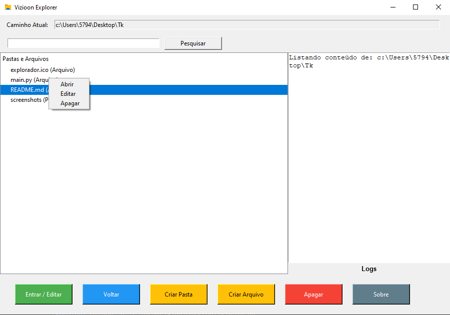
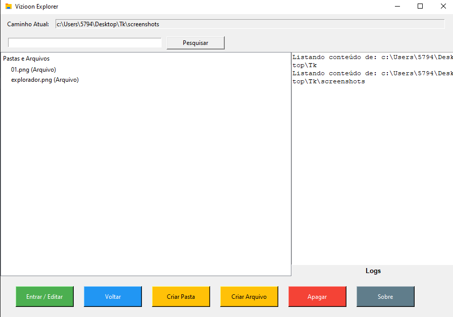
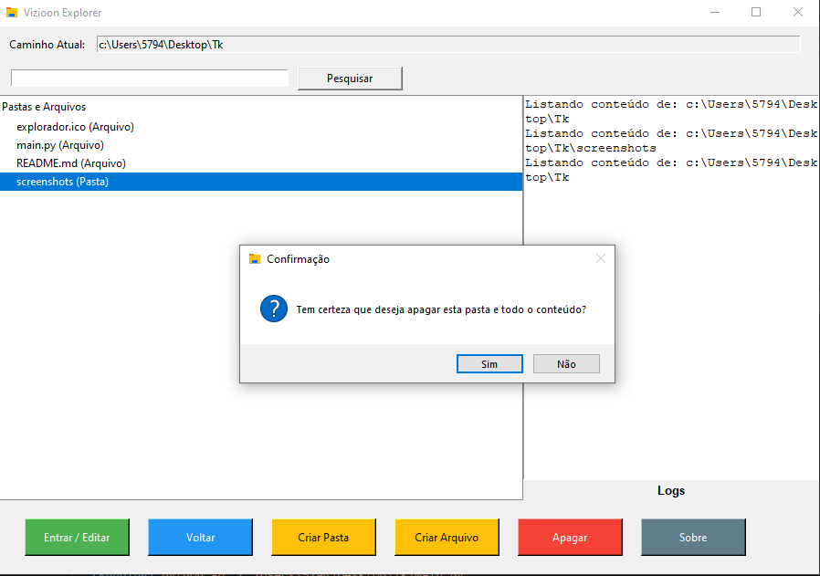

# Vizioon Explorer 


Este projeto é um **explorador de arquivos** simples, desenvolvido em **Python** com a biblioteca **Tkinter** para fornecer uma interface gráfica intuitiva para navegação entre diretórios, gerenciamento de arquivos e pastas, além de oferecer funcionalidades como edição, criação e exclusão de arquivos e pastas.

## Funcionalidades Principais

- **Navegar entre diretórios**: O usuário pode navegar pelos diretórios de seu sistema de arquivos.
- **Criação de arquivos e pastas**: Interface amigável para criar novos arquivos de texto e novas pastas.
- **Edição de arquivos**: Arquivos de texto podem ser editados diretamente na interface com um editor embutido.
- **Exclusão de arquivos e pastas**: Arquivos e pastas podem ser excluídos, com confirmação para exclusão de pastas e seus conteúdos. Uma barra de progresso é exibida durante a exclusão de pastas grandes.
- **Abrir arquivos**: Arquivos podem ser abertos no programa padrão do sistema operacional.
- **Abrir no navegador**: Arquivos HTML, CSS e JS podem ser abertos diretamente no navegador.
- **Logs de operações**: Um painel de logs exibe as operações realizadas, como exclusão, abertura e edição de arquivos, além de mensagens de erro.
- **Pesquisa de arquivos e pastas**: Permite pesquisar arquivos e pastas no diretório atual.
- **Barra de progresso**: Exibe o progresso da exclusão de pastas grandes, mostrando a remoção de arquivos e subpastas.

### Linguagem:


### Bibliotecas:
- 
- 
- 
- 
- 


## Requisitos

- **Python 3.x**
- Bibliotecas padrão do Python:
  - `os`
  - `shutil`
  - `tkinter`
  - `webbrowser`
  - `subprocess`

## Instalação

1. Certifique-se de que você tem o Python 3.x instalado.
2. Clone ou baixe este repositório.
3. Execute o arquivo `main.py` com o Python.

```py
python main.py
```

## Uso

### Navegação
- Ao iniciar o programa, o diretório atual é exibido em uma interface de árvore (TreeView).
- Para **entrar em uma pasta**, clique duas vezes nela.
- Para **voltar à pasta anterior**, use o botão "Voltar".

### Criação de Arquivos e Pastas
- Para **criar uma nova pasta**, clique no botão "Criar Pasta", insira o nome da pasta e ela será criada no diretório atual.
- Para **criar um arquivo**, clique no botão "Criar Arquivo" e insira o nome do arquivo com a extensão `.txt`.

### Edição de Arquivos
- Para editar um arquivo de texto, clique com o botão direito no arquivo e selecione "Editar". Uma nova janela será aberta com o conteúdo do arquivo, permitindo que você faça alterações e as salve.

### Exclusão de Arquivos e Pastas
- Para excluir um arquivo ou pasta, clique com o botão direito e selecione "Apagar".
- Se for uma pasta, você será solicitado a confirmar a exclusão de todos os itens dentro dela. Uma barra de progresso é exibida para mostrar o andamento da operação.

### Abertura de Arquivos
- Para abrir arquivos `.html`, `.css` ou `.js` no navegador, clique com o botão direito e selecione "Abrir no Navegador".
- Para outros tipos de arquivos, clique com o botão direito e selecione "Abrir" para executá-lo no programa padrão do sistema.

### Logs de Operações
- O painel de logs exibe todas as operações realizadas, como exclusão de arquivos, erros e eventos relacionados à navegação e edição.

### Barra de Progresso
- Quando você exclui uma pasta, uma barra de progresso exibe o status da exclusão de arquivos e subpastas.

## Capturas de Tela





## Personalização

Se quiser adaptar o projeto às suas necessidades, você pode:
- **Adicionar suporte a novos tipos de arquivos**: Personalize as ações de abrir e editar para diferentes extensões de arquivos.
- **Alterar a interface gráfica**: Altere cores, fontes e tamanhos de botões na interface.
- **Expandir funcionalidades**: Adicione opções como copiar e mover arquivos entre diretórios.

## Autor

Desenvolvido por **Daniel Estevão Martins Mendes**.

## Licença

Este projeto está licenciado sob os termos da licença MIT.
